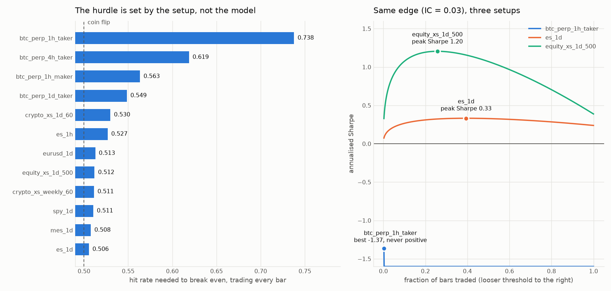

# The setup that clears the hurdle

The first pass at this project asked TimesFM for a directional edge on BTC/USD
perpetuals, hourly, taker fees, trading every bar. It needed a 73.8% hit rate to break
even. That is not a hard target, it is an impossible one, and no model was ever going to
clear it.

The hurdle was never a fact about markets. It was a consequence of five choices, all of
which were free to make differently. This document works out what those choices cost,
picks better ones, and shows the difference on data where the right answer is known in
advance.

**Reproduce everything here with:**

```bash
python -m tfm_edge.analysis.feasibility --ic 0.03 --plot reports/feasibility.png
python -m tfm_edge.analysis.compare_setups
```

---

## 1. One number decides everything

For a signal traded on sign alone, every bar, the break-even hit rate is

```
p* = 0.5 + c / (2 E|r|)  =  0.5 + 0.627 k        where  k = round-trip cost / per-bar volatility
```

`k` is the entire game. It has nothing to do with the model. Across ordinary,
retail-accessible instruments it spans a factor of forty:

| setup | round trip | per-bar vol | k | hit rate needed |
|---|---|---|---|---|
| BTC perp, 1h, taker | 15 bps | 39 bps | 0.379 | **0.738** |
| BTC perp, 4h, taker | 15 bps | 79 bps | 0.190 | 0.619 |
| BTC perp, 1h, maker | 4 bps | 39 bps | 0.101 | 0.563 |
| BTC perp, 1d, taker | 15 bps | 194 bps | 0.077 | 0.549 |
| ES future, 1h | 0.9 bps | 21 bps | 0.043 | 0.527 |
| S&P 500 cross-section, 1d | 3 bps | 157 bps | 0.019 | 0.512 |
| MES future, 1d | 1.25 bps | 101 bps | 0.012 | 0.508 |
| ES future, 1d | 0.9 bps | 101 bps | 0.009 | **0.506** |



The original setup sat at the worst end of a range it did not have to be in. Hourly
crypto at taker fees is the single most expensive way to express a forecast that is
available to a retail account. Index futures on daily bars are roughly forty times
cheaper per unit of risk, because the tick is small relative to the daily move and the
commission is negligible against a six-figure notional.

**This is the finding.** Everything below compounds on top of it.

---

## 2. Five levers, and what each is worth

### 2.1 The instrument and the bar (up to 40x)

Cost is charged per round trip; volatility grows with the square root of the holding
period. Every doubling of the bar length cuts `k` by about 30% for free. Moving from
crypto perpetuals to index futures cuts it by another order of magnitude, because the
spread is a far smaller fraction of the price.

Nothing about this is a trick. It is the reason professional systematic trading happens
in deep futures and equity markets rather than in hourly retail crypto.

### 2.2 Turnover accounting (2x, and it was a measurement error)

The original harness charged a full round trip on *every* bar the signal was non-zero.
A real implementation charges on position *change*: if the signal says long two bars
running, you hold and pay nothing.

For a signal that flips at random, `E|Δw| = 1.0`, so the correct cost is half what was
charged. For a persistent signal it is far less. `analysis/portfolio.py` charges
`|w_t − w_{t−1}| × c/2`, so a full reversal costs exactly one round trip and holding
costs zero. This was not a modelling choice, it was a bug in the pessimistic direction,
and fixing it roughly doubles every net number in the original report.

### 2.3 Selection (up to 3x on the signal)

Trading only when the standardised forecast clears a threshold multiplies the expected
signed return per trade by `E[|z| | |z|>τ]`, which rises without bound, while the cost
per trade is unchanged.

**The trap:** selection raises `E[signed return]`, *not* `E[|r|]`. For a weak
directional signal the size of the realised move is dominated by noise and barely shifts
with the forecast. "Only trade the big predicted moves" does not find bigger moves. It
concentrates the edge, and that is enough, but expecting the other thing leads to
overestimating the filter by a factor of two or three.

Sharpe per bar has a clean closed form, which is what `feasibility.py` optimises:

```
Sharpe_bar(τ) = sqrt(f(τ)) · (IC · M(τ) − k · turnover)
    f(τ) = 2(1 − Φ(τ))                trade fraction
    M(τ) = φ(τ) / (1 − Φ(τ))          E[|z| | |z| > τ]
```

Because `M` grows without bound, *any* positive IC is profitable at a sufficiently
extreme threshold. But `f → 0`, so the Sharpe goes to zero too. There is an interior
optimum, and it is usually looser than intuition suggests: at IC 0.03 on daily futures
the best threshold trades about 39% of bars, not 5%.

### 2.4 Cross-section and residualisation (3-4x, and the only lever that also buys proof)

This is the largest single improvement and it works twice over.

**Removing the market from the target.** A dollar-neutral book earns the *residual*
return. The market factor is the most volatile and least predictable component of any
equity or crypto return, so removing it shrinks the volatility your edge must overcome
while leaving the cost per unit of notional unchanged.

**Removing the market from the input.** Feed the model each asset's cumulative residual
log price rather than its raw price. Measured on the synthetic panel, this lifts IC from
0.070 to 0.101 and drops target volatility from 364 to 300 bps at the same time. In the
end-to-end comparison it is the difference between STOP and PROCEED.

**Breadth.** Sharpe scales as `IC × sqrt(independent bets)`. Sixty names with correlated
residuals give perhaps twelve independent bets, so roughly 3.5x. And breadth is the only
lever that improves *statistical power* as well as return: it takes the track record
needed to distinguish the result from luck from 9.7 years down to 4.9. A setup you
cannot prove within your own lifetime is not a research programme.

### 2.5 Smoothing and rebalance spacing (2-4x on cost, in the cross-section)

A daily full rebalance of a 60-name book at 7.5 bps a side costs more per year than most
real signals earn. Smoothing the score with a short EWMA, or holding the book for
several bars, cuts turnover sharply for a small loss of signal freshness.

In the sweep this shows up starkly. The highest-Sharpe cell is *not* the one to pick:

| slice | smoothing | Sharpe | Sharpe at 2x costs | turnover |
|---|---|---|---|---|
| 0.3 | none | **4.28** | 0.41 | 1.35 |
| 0.3 | halflife 2 | 3.87 | **1.83** | 0.70 |

Ranking cells by headline Sharpe systematically selects the highest-turnover, most
cost-fragile configuration, which is exactly the one whose apparent edge most depends on
the cost assumption being right. **The harness therefore selects on the 2x-cost Sharpe
and reports both.** Robust by construction rather than by hope.

---

## 3. Same edge, five setups

One synthetic panel, one small planted edge (idiosyncratic AR(1), phi = 0.06, no
predictability whatsoever in the market factor), 2,600 daily bars. Every row trades that
identical edge a different way. Nothing about the signal changes between rows.

| setup | cross-sec IC | Sharpe | Sharpe 2x | DSR | years needed / have | verdict |
|---|---|---|---|---|---|---|
| 1 asset, daily, crypto taker | 0.0275 | 0.85 | 0.55 | 0.6299 | 9.7 / 5.5 | `STOP` |
| 60 assets, daily, taker, no residualisation | 0.0499 | 3.65 | 1.74 | 0.8599 | 5.0 / 5.5 | `STOP` |
| 60 assets, daily, taker, beta residualisation | 0.0607 | 3.87 | 1.83 | 0.9720 | 4.9 / 5.5 | `PROCEED` |
| 60 assets, daily, maker fees, residualisation | 0.0607 | 7.13 | 6.10 | 1.0000 | 4.9 / 5.5 | `PROCEED` |
| 60 assets, daily, equity fees, residualisation | 0.0607 | 7.39 | 6.61 | 1.0000 | 4.6 / 5.5 | `PROCEED` |

Sharpe 0.85 to 3.87, and STOP to PROCEED, with no change to the model, the data, or the
edge. Note the second row: breadth alone is not enough. Residualisation is what carries
it over the line, and it is one line of code.

These Sharpes are far higher than anything to expect from real data. phi = 0.06 across
60 clean, jump-free, Gaussian assets with no regime change is a much stronger and much
tidier signal than markets offer. The ratios between rows are the finding; the levels
are a property of the simulation.

---

## 4. What replaced the hit-rate gate

Hit rate is a weak objective. A model can be right 48% of the time and be very
profitable if it is right on the large moves, or right 55% of the time and lose. Worse,
the hit-rate gate cannot see the threshold sweep at all, so it silently permits the
largest multiple-testing surface in the project.

The strategy gate (`analysis/gate.py: evaluate_strategy_gate`) requires all of:

1. **Deflated Sharpe Ratio > 0.95**, deflating the winning cell against every cell in
   the sweep plus every variant in the ledger. This is Bailey & López de Prado's
   correction: it accounts for the number of trials, the sample length, and the skew and
   kurtosis of the return stream, none of which a Bonferroni bound on a hit rate sees.
2. **Still positive at 2x costs.** A result that dies when costs double was a cost
   assumption, not an edge.
3. **Beats the same portfolio construction driven by each baseline.** If last-sign wins,
   you have rediscovered momentum with extra steps.
4. **Positive in more than half the folds.** A pass concentrated in one fold is a
   regime.
5. **Enough data to have detected the Sharpe it claims** (minimum track record length).
   A Sharpe of 0.3 needs about 33 years to distinguish from zero. Claiming it on four
   years of data is not a finding.

The old hit-rate gate is still computed and reported. Both verdicts appear side by side,
and both must be read.

---

## 5. Where the edge is most likely to actually be

Everything above lowers the hurdle. None of it creates an edge. On what TimesFM is
likely to have an edge *at*, the honest reading of its training corpus matters.

TimesFM is trained overwhelmingly on seasonal, structured series: electricity load,
traffic, web visits, weather, retail demand. Its inductive bias is level, trend and
seasonality. Financial *returns* have essentially none of that, which is the whole
reason they are hard. But several financial series adjacent to returns are exactly the
shape TimesFM is good at:

- **Realised volatility.** Strongly seasonal (intraday U-shape, day-of-week, weekend
  effects in crypto) and strongly autocorrelated. Test B already measures this.
- **Perpetual funding rates.** Paid every 8 hours, mean-reverting, strongly
  autocorrelated, and a directly harvestable cash flow via a basis trade rather than a
  directional bet.
- **Volume and order-flow imbalance.** Heavily periodic.

If Test A fails and Test B passes, that is not a consolation prize. A volatility
forecast that genuinely beats GARCH is worth money in three concrete ways: sizing any
position by predicted volatility (volatility-managed portfolios are a documented,
published source of Sharpe improvement), setting bracket widths that stay stable across
regimes, and timing variance-premium trades. None of those require a directional edge.

**The recommended order of attack, most to least likely to work:**

1. Cross-sectional, market-neutral, daily, on a cheap universe, residualised inputs.
2. Forecast funding rates or realised volatility, monetise via carry or sizing.
3. Single-instrument directional on index futures at daily bars, where the hurdle is
   0.506 and only breadth is missing.
4. Single-instrument directional on hourly crypto perpetuals. This is where the project
   started and it is the worst option available.

---

## 6. What is still most likely to be wrong

The levers above are arithmetic and they are sound. The risks have moved, not vanished.

1. **Maker fills are not backtestable from OHLCV bars.** The maker row in the comparison
   table assumes a resting order fills at the posted price. It does not model adverse
   selection (a resting bid fills when the market is coming down through it) or fill
   *failure*, and the bars where a limit order does not fill are exactly the ones that
   ran away in your favour. That is a selection bias that flatters the backtest and it
   needs L2 or trade data to model. **Treat every maker number in this repo as an upper
   bound, not an estimate.**
2. **Cross-sectional books have costs the single-instrument case does not.** Shorting
   requires borrow (equities) or pays/charges funding (perps); some names are hard to
   borrow; a 60-name book has 60 spreads to cross, and the cheapest names by fee are
   usually the widest by spread. The flat per-name cost used here is an idealisation.
3. **Effective breadth is a guess.** Twelve independent bets from sixty correlated crypto
   perps is a plausible number, not a measured one. If residual correlation is higher
   than assumed, the Sharpe multiplier and the track-record maths are both optimistic.
   Measure it from the residual correlation matrix before relying on it.
4. **Costs are state-dependent and modelled as constant.** Spreads widen and slippage
   explodes precisely in the high-volatility bars where a selective strategy most wants
   to trade. The 2x-cost row is a crude proxy for this; a proper model would scale cost
   with predicted volatility.
5. **Panel survivorship.** A crypto universe chosen today by liquidity is a list of
   things that survived. Backtesting it over four years embeds a large, well-documented
   upward bias. The universe must be reconstructed as it stood at each point in time.
6. **The synthetic demonstration is Gaussian, stationary and jump-free.** It proves the
   pipeline recovers a planted cross-sectional edge and rejects noise. It proves nothing
   about whether such an edge exists in real markets.
7. **Nothing here has touched real data or real TimesFM weights.** The build container
   cannot reach Binance or HuggingFace. Every number in this document is either closed-
   form arithmetic or a synthetic demonstration.

---

## 7. Bottom line

The original question was "is TimesFM good enough to trade hourly BTC?" The answer is no,
and it was decidable before running the model, because the setup required a 73.8% hit
rate.

The better question is "what is the cheapest, broadest, most residualised way to express
whatever edge this model has?" With that setup the hurdle drops to about 51%, the same
underlying edge produces four times the Sharpe, and, most importantly, a real result
becomes provable in five years instead of ten.

That still does not mean an edge exists. It means the experiment is now worth running.
